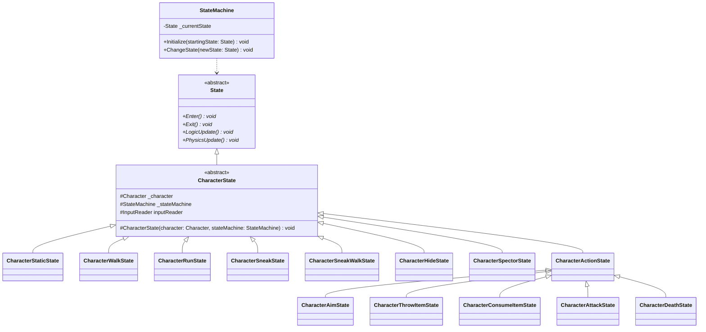

```mermaid
classDiagram
	class State {
		<<abstract>>
		+Enter()* void
		+Exit()* void
		+LogicUpdate()* void
		+PhysicsUpdate()* void
	}
	class StateMachine {
		-State _currentState

		+Initialize(startingState: State) void
		+ChangeState(newState: State) void
	}
	StateMachine ..> State

	class CharacterState {
		<<abstract>>
		#Character _character
		#StateMachine _stateMachine
		#InputReader inputReader

		#CharacterState(character: Character, stateMachine: StateMachine) void
	}
	State <|-- CharacterState

	class CharacterStaticState { }
	CharacterState <|-- CharacterStaticState
	
	class CharacterWalkState { }
	CharacterState <|-- CharacterWalkState
	
	class CharacterRunState { }
	CharacterState <|-- CharacterRunState
	
	class CharacterSneakState { }
	CharacterState <|-- CharacterSneakState

	class CharacterSneakWalkState { }
	CharacterState <|-- CharacterSneakWalkState
	
	class CharacterHideState { }
	CharacterState <|-- CharacterHideState

	class CharacterSpectorState { }
	CharacterState <|-- CharacterSpectorState
	
	class CharacterActionState { }
	CharacterState <|-- CharacterActionState
	
	class CharacterAimState { }
	CharacterActionState <|-- CharacterAimState
	
	class CharacterThrowItemState { }
	CharacterActionState <|-- CharacterThrowItemState

	class CharacterConsumeItemState { }
	CharacterActionState <|-- CharacterConsumeItemState
	
	class CharacterAttackState { }
	CharacterActionState <|-- CharacterAttackState

	class CharacterDeathState
	CharacterActionState <|-- CharacterDeathState
```