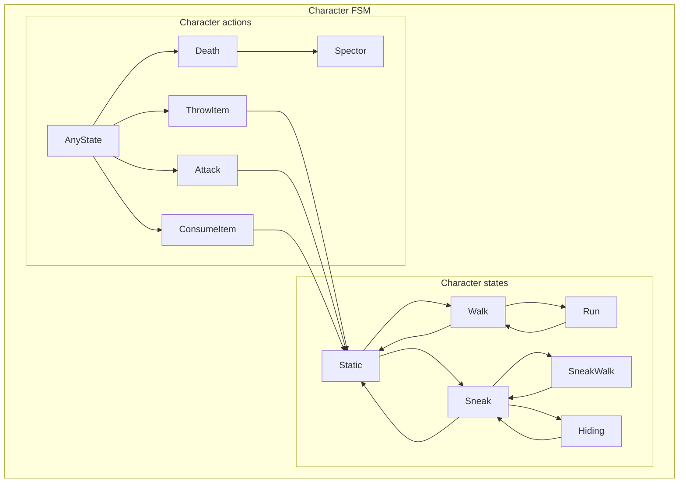

```mermaid
graph
	subgraph Character FSM
		subgraph Character states
		direction TB
		Static --> Walk
		Walk --> Static
		Static --> Sneak
		Walk --> Run
		Run --> Walk
		Sneak --> Static
		Sneak --> SneakWalk
		SneakWalk --> Sneak
		Sneak --> Hiding
		Hiding --> Sneak
		end
		subgraph Character actions
		direction LR
		AnyState --> ThrowItem & Attack & Death & ConsumeItem
		ThrowItem & Attack & ConsumeItem --> Static
		Death --> Spector
		end
	end
```