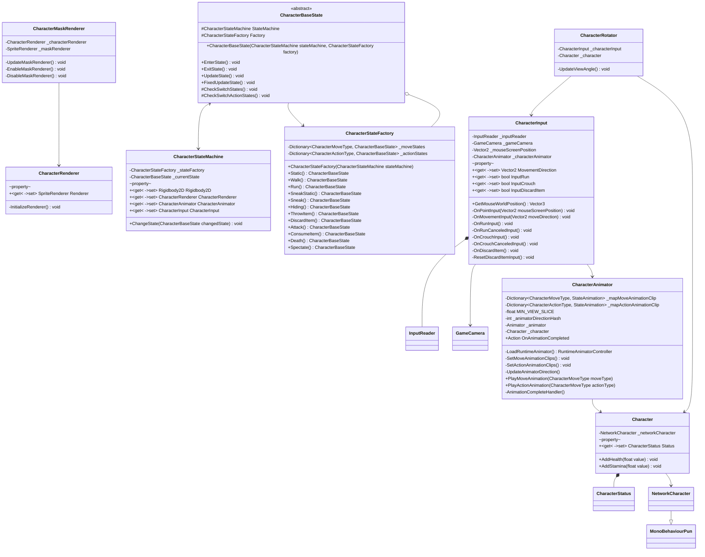

```mermaid
classDiagram
	class CharacterStateMachine {
		-CharacterStateFactory _stateFactory
		-CharacterBaseState _currentState
		
		~property~
		+~get~ -~set~ Rigidbody2D Rigidbody2D
		+~get~ -~set~ CharacterRenderer CharacterRenderer
		+~get~ -~set~ CharacterAnimator CharacterAnimator
		+~get~ -~set~ CharacterInput CharacterInput

		+ChangeState(CharacterBaseState changedState) void
	}

	class Character {
		-NetworkCharacter _networkCharacter
		~property~
		+~get~ -~set~ CharacterStatus Status

		+AddHealth(float value) void
		+AddStamina(float value) void
	}
	Character *-- CharacterStatus

	class NetworkCharacter {
	
	}
	NetworkCharacter --|> MonoBehaviourPun
	Character --> NetworkCharacter

	class CharacterInput {
		-InputReader _inputReader
		-GameCamera _gameCamera
		-Vector2 _mouseScreenPosition
		-CharacterAnimator _characterAnimator
		
		~property~
		+~get~ -~set~ Vector2 MovementDirection
		+~get~ -~set~ bool InputRun
		+~get~ -~set~ bool InputCrouch
		+~get~ -~set~ bool InputDiscardItem

		+GetMouseWorldPosition() Vector3
		-OnPointInput(Vector2 mouseScreenPosition) void
		-OnMovementInput(Vector2 moveDirection) void
		-OnRunInput() void
		-OnRunCanceledInput() void
		-OnCrouchInput() void
		-OnCrouchCanceledInput() void
		-OnDiscardItem() void
		-ResetDiscardItemInput() void
	}
	CharacterInput *-- InputReader
	CharacterInput --> GameCamera
	CharacterInput --> CharacterAnimator

	class CharacterRenderer {
		~property~
		+~get~ -~set~ SpriteRenderer Renderer

		-InitializeRenderer() void
	}

	class CharacterMaskRenderer {
		-CharacterRenderer _characterRenderer
		-SpriteRenderer _maskRenderer

		-UpdateMaskRenderer() void
		-EnableMaskRenderer() void
		-DisableMaskRenderer() void
	}
	CharacterMaskRenderer --> CharacterRenderer

	class CharacterAnimator {
		-Dictionary~CharacterMoveType, StateAnimation~ _mapMoveAnimationClip
		-Dictionary~CharacterActionType, StateAnimation~ _mapActionAnimationClip
		-float MIN_VIEW_SLICE
		-int _animatorDirectionHash
		-Animator _animator
		-Character _character
		+Action OnAnimationCompleted

		-LoadRuntimeAnimator() RuntimeAnimatorController
		-SetMoveAnimationClips() void
		-SetActionAnimationClips() void
		-UpdateAnimatorDirection()
		+PlayMoveAnimation(CharacterMoveType moveType)
		+PlayActionAnimation(CharacterMoveType actionType)
		-AnimationCompleteHandler()
	}
	CharacterAnimator --> Character

	class CharacterRotator {
		-CharacterInput _characterInput
		-Character _character

		-UpdateViewAngle() void
	}
	CharacterRotator --> CharacterInput
	CharacterRotator --> Character

	class CharacterBaseState {
		<<abstract>>
		#CharacterStateMachine StateMachine
		#CharacterStateFactory Factory
		
		+CharacterBaseState(CharacterStateMachine stateMachine, CharacterStateFactory factory)
		+EnterState() void
		+ExitState() void
		+UpdateState() void
		+FixedUpdateState() void
		#CheckSwitchStates() void
		#CheckSwitchActionStates() void
	}
	CharacterBaseState <--> CharacterStateMachine
	CharacterBaseState --> CharacterStateFactory

	class CharacterStateFactory {
		-Dictionary~CharacterMoveType, CharacterBaseState~ _moveStates
		-Dictionary~CharacterActionType, CharacterBaseState~ _actionStates

		+CharacterStateFactory(CharacterStateMachine stateMachine)
		+Static() CharacterBaseState
		+Walk() CharacterBaseState
		+Run() CharacterBaseState
		+SneakStatic() CharacterBaseState
		+Sneak() CharacterBaseState
		+Hiding() CharacterBaseState
		+ThrowItem() CharacterBaseState
		+DiscardItem() CharacterBaseState
		+Attack() CharacterBaseState
		+ConsumeItem() CharacterBaseState
		+Death() CharacterBaseState
		+Spectate() CharacterBaseState
	}
	CharacterBaseState o-- CharacterStateFactory
```