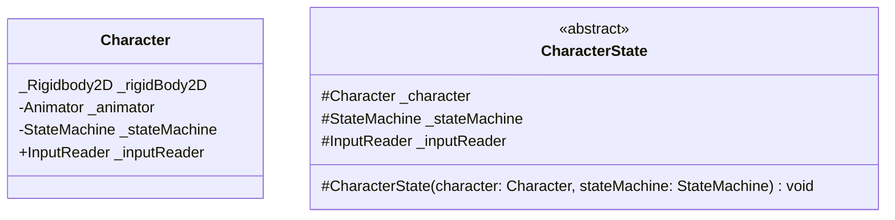

```
	class Character {
		void Start() {
			_stateMachine = new();
			_stateMachine.Initialize(new CharacterStaticState(this, _stateMachine));
		}

		void Update() {
			_stateMachine.LogicUpdate();
		}

		void FixedUpdate() {
			_stateMachine.PhysicsUpdate();
		}
	}

	class CharacterStaticState {

		Vector2 _moveInput;
		
		void Enter() {
			_character.GetAnimator().Play("Idle");
			_inputReader.OnMoveInput += OnMove;
		}

		void Exit() {
			
		}

		void PhysicsUpdate {
			if (_moveInput.sqrMagnitude >= float.Epsilon) {
				_stateMachine.Enter(new CharacterWalkState(_character, _stateMachine));
			}
		}

		void OnMove(Vector2 input) {
			_moveInput = input;
		}
	}
```